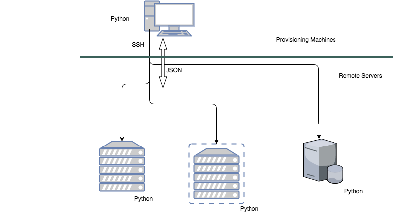

<!--slide-->
# Ansible Session
<!--slide-->
## Overview of ansible

### What is Ansible?
* An automation tool
* Configuration Management
* Infrastructure Provisioning and Orchestration

### Why Ansible?
* Agent less
* No database
* Simple to use - YAML
* Python and JSON based
* Great community
* Idempotence
* Secure

<!--slide-->
### Big Picture

<!--slide-->
### Important Concepts
* Inventory
* Config
* Modules
* Playbook
  * Plays
* Variables
<!--slide-->
### Ansible Needs
#### Control server/ Provisioning machine - Manager
* \*NIX variants only
* Python 2.6 +
* No Python 3

#### Remote server - Managed
* \*NIX + Windows
* Python 2.5+ (2.4 possible)
* SSH
* Remote Powershell for Windows
* No Python 3

<!--slide-->
## Overview of the lab setup
  * Vagrant & Virtualbox
  * Quick overview of the vagrant file
    * apm - Ansible Provisioning Machine. Where ansible runs
    * service - Remote server hosting the service (web)
    * db - Remote server hosting the database
    * syncing folders - so that I can edit code here.
  * A_SESSION_HOME = Home folder of where the session related artifacts are downloaded or kept
  * Ansible code - `cd $A_SESSION_HOME/demo-lab/provisioning/ansible`
  * `cd $A_SESSION_HOME/demo-lab`
  * `vagrant up`
  * **In Another Terminal** `vagrant rsync-auto`

<!--slide-->
## Ansible installation
  * apt-get
    * `vagrant ssh apm`
    * `sudo apt-get install ansible`
    * Installs an old version 1.5.4
  * apt-get latest version (Demo)
    * `sudo apt-get install software-properties-common`
    * `sudo apt-add-repository ppa:ansible/ansible`
    * `sudo apt-get update`
    * `sudo apt-get install ansible`
  * yum
  * pip

<!--slide-->
## Ansible Hello World - Our First Interaction
* `cd ansible` : This is our working directory
* `ansible all -i inventory -u vagrant -k -m ping`
* ssh fingerprint issue
  * `ssh vagrant@192.168.33.30` -- example
* `ansible all -i inventory -u vagrant -k -m ping -vvvv`

<!--slide-->
## Inventory Basics
* `ansible all -i inventory1 -m ping`
* Walk through `inventory1`
* groups
* children
* vars for hosts and groups
* Order of preference of vars
  * All < Group < Host
* [Reference](http://docs.ansible.com/ansible/intro_inventory.html)
* `ansible datacenter -i inventory1 -m ping` - runs on datacenter group which has two children
* `ansible service_hosts -i inventory1 -m ping` - runs on a single group
* `ansible service1 -i inventory1 -m ping` - runs on a specific node

<!--slide-->
## Ansible config Basics
* Config order of preference
  * environment variable > ./ansible.cfg > ~/.ansible.cfg > /etc/ansible/ansible.cfg
  * first one wins! no merging
* [Reference](http://docs.ansible.com/ansible/intro_configuration.html)
* `ansible datacenter -m ping`

<!--slide-->
## Ansible Modules
* There are many modules available in ansible.
  * core
  * extras (contributed)
  * deprecated
* Different categories of modules available. Refer [here](http://docs.ansible.com/ansible/modules_by_category.html)
* `ansbile-doc` - module documentation in the local (without net)
  * `ansible-doc -l` and `ansible-doc -s apt`
* Direct command to execute across parent groups
  * `ansible datacenter -m command -a "apt-get update" --sudo`
* A Shell Command to execute only on a particular group
  * `ansible service_hosts -m shell -a "echo $PATH"`
* Running Apt Module on a particular group
  * `ansible service_hosts -i inventory1 -m apt -a "update_cache=yes" -s`

<!--slide-->
## Ansible Playbook basics
* The playbook brings it all together.
* Walk through the my_app.yml
* Check the individual nodes for demo purposes that nothing is already installed on them)
  * db node
    * `which psql`
    * `service --status-all`
    * `service postgresql status`
  * service node
    * `which node`
    * `which npm`
    * `npm list -g`
* Run `ansible-playbook my_app.yml`
* Rerun the checks and confirm installation

<!--slide-->
## Summarizing what to watch out for
* Yaml!
  * _Whitespace_ finicky!
  * Start a document with ---
  * \# for comments
  * key value pairs -> a: b  (Note the space after colon)
  * for yaml enthusiasts - [refer here](http://www.yaml.org/refcard.html)
* Bugs in commands

<!--slide-->
## Demo gotchas
* inventory file had execute permissions
  * [Reference](http://stackoverflow.com/questions/18385925/error-when-running-ansible-playbook)
  * `chmod 644 inventory`
* check if rsync-auto is running on another terminal. more details on rsync-auto [here](https://www.vagrantup.com/docs/cli/rsync-auto.html).
* found apt module does not work on update_cache mode. Could not find the reason. One possibility could be [this](https://github.com/ansible/ansible-modules-core/issues/1497)

<!--slide-->
## What is Not Covered
* Scaling out inventory - Ability to split out the inventory configuration
* Execution Types - The way ansible gets executed. There are options
* Var Prompts - Ability to prompt for variables
* Handlers - Event handling
* Templates - Templating which allows to create config files etc with dynamic varibles
* Conditionals - Ability to chose to execute a task or not
<!--slide-->
* Roles - Reusable playbooks
* Pre and Post tasks - Tasks to be executed before and after
* Host Targeting patterns - More flexible ways by which tasks can be targeted to hosts
* Vault - Ability to keep and manage secrets like passwords
* Tower - Commercial offering which provides a management interface which would help enterprises to manage their ansible setup.
* And more... (Tags, Site etc.)
* Docker support - Yes it is supported!

<!--slide-->
## References
* https://www.ansible.com/how-ansible-works
* https://www.upguard.com/articles/ansible-vs.-ansible-tower
* http://docs.ansible.com/
* https://serversforhackers.com/an-ansible-tutorial
* https://www.pluralsight.com/courses/hands-on-ansible
